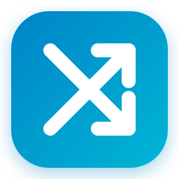

# OmniDesk

<p align="center">
  
</p>

<p align="center">
  <strong>Cross-Platform Local P2P Clipboard Sync & File Sharing for Linux, macOS & Windows</strong><br>
  <em>Sincronização P2P de Área de Transferência e Compartilhamento de Arquivos Local</em>
</p>

<p align="center">
  <a href="https://github.com/thyagoluciano/OmniDesk/actions/workflows/ci.yml"></a>
  <a href="https://golang.org/"></a>
  <a href="#"></a>
  <a href="https://github.com/thyagoluciano/OmniDeskMobile"></a>
  <a href="LICENSE"></a>
  <a href="ROADMAP.md"></a>
  <a href="CONTRIBUTING.md"></a>
</p>

<p align="center">
  <a href="README.md">🇧🇷 Português</a> &nbsp;•&nbsp;
  <strong>🇺🇸 English</strong> &nbsp;•&nbsp;
  <a href="README.es.md">🇪🇸 Español</a>
</p>

<p align="center">
  <a href="#-what-is-omnidesk">About</a> &nbsp;•&nbsp;
  <a href="#-the-omnidesk-ecosystem-desktop--mobile">Ecosystem</a> &nbsp;•&nbsp;
  <a href="#-quick-installation-installers">Installers</a> &nbsp;•&nbsp;
  <a href="#-how-to-use">How to Use</a> &nbsp;•&nbsp;
  <a href="#-cli-mode-command-line">CLI Mode</a> &nbsp;•&nbsp;
  <a href="#-building-from-source">Build from Source</a> &nbsp;•&nbsp;
  <a href="#-community--contributing">Community</a>
</p>

---

## 💡 What is OmniDesk?

**OmniDesk** is an open-source, cross-platform productivity tool (Linux, macOS, and Windows) designed for real-time clipboard synchronization and seamless local file transfers between your computers on the same local network (Wi-Fi or Ethernet cable), with zero cloud dependencies.

Unlike cloud-based tools, OmniDesk operates **100% peer-to-peer (P2P)**:

- 🔒 **Absolute Privacy & Zero Cloud**: Your files, links, and snippets never leave your local network. No accounts required, no telemetry, and no user tracking.
- ⚡ **Local Network Speed**: Direct transfers operating at the maximum bandwidth of your Wi-Fi or local network cable.
- 🛡️ **Simple & Secure Pairing**: Devices authenticate with each other using a transient **6-digit PIN** and unique cryptographic tokens.
- 🖥️ **Modern Web Dashboard & System Tray**: Monitor and control connections via an intuitive web interface or from your desktop's system tray / menu bar.

---

## ✨ Key Features

- 📋 **Seamless Clipboard Sync**: Copy text, links, or code snippets on one machine and paste them instantly on your other machines (equipped with loop-prevention).
- 📁 **Direct File Transfer**: Send files of any size by dragging and dropping (*drag & drop*) in the browser or using the command line.
- 🔍 **Instant Peer Discovery**: Automatic local detection of neighboring machines using mDNS (ZeroConf) and subnet scanning.
- 💻 **Intuitive Web Dashboard**: Modern control panel accessible at `http://127.0.0.1:24850/ui/` or via `omnidesk gui`.
- 🔔 **Native Notifications & System Tray**: Tray/menu bar icon across Linux, macOS, and Windows with transfer and pairing alerts.
- ⚙️ **Autostart with System**: Runs automatically in the background on user login without requiring administrative privileges (`root`/`sudo`).

---

## 📱 The OmniDesk Ecosystem (Desktop + Mobile)

OmniDesk is built as a complete, zero-friction local-first productivity ecosystem. It consists of two complementary open-source repositories:

| Project | Target Platforms | Tech Stack | Repository |
| :--- | :--- | :--- | :--- |
| 🖥️ **OmniDesk** *(This repository)* | Linux, macOS, Windows | Go, Web/JS, Native Tray | [thyagoluciano/OmniDesk](https://github.com/thyagoluciano/OmniDesk) |
| 📱 **OmniDesk Mobile** | iOS, Android | Flutter, Dart, Hardware Crypto | [thyagoluciano/OmniDeskMobile](https://github.com/thyagoluciano/OmniDeskMobile) |

### 🔄 How Desktop & Mobile Work Together:

```
┌─────────────────────────────────┐                 ┌─────────────────────────────────┐
│        OmniDesk Desktop         │                 │         OmniDesk Mobile         │
│  (macOS / Linux / Windows)      │                 │         (iOS / Android)         │
│                                 │                 │                                 │
│  • Go Daemon (Port 24850)       │  Wi-Fi / LAN    │  • Flutter Client (Port 24851)  │
│  • Web Dashboard & System Tray  │◄───────────────►│  • In-App QR Camera Scanner     │
│  • QR Pairing Session Generator │ mDNS / Bonjour  │  • Gallery & File Picker        │
│  • OS Clipboard Engine          │ P2P Sockets     │  • Secure Keychain / Keystore   │
└─────────────────────────────────┘                 └─────────────────────────────────┘
```

1. **Zero-Configuration Discovery**: Both desktop nodes and mobile devices announce themselves via Bonjour / mDNS (`_omnidesk._tcp`) over your local Wi-Fi.
2. **Instant QR Code Pairing**: On your desktop Web UI (`/ui/`), click **Pair Phone (QR Code)**. On your phone, launch [OmniDesk Mobile](https://github.com/thyagoluciano/OmniDeskMobile) and scan the code displayed on your screen. Cryptographic auth tokens are exchanged mutually in seconds.
3. **Seamless Clipboard Bridge**: Copy text, links, or code on your phone and paste instantly on your workstation (or vice-versa), with built-in anti-echo loop prevention.
4. **Instant Photo & File Beaming**: Select photos directly from your camera roll or browse documents to beam them directly to your desktop at maximum local Wi-Fi speeds without internet or cloud storage.

---

## 📦 Quick Installation (Installers)

We recommend installing OmniDesk using the ready-to-use packages for your operating system:

### 🍏 macOS (Apple Silicon M1/M2/M3/M4 & Intel)

- **Disk Image Installer (`.dmg`)**:
  1. Download `OmniDesk.dmg` from the [Releases](https://github.com/thyagoluciano/OmniDesk/releases) page.
  2. Open the disk image and drag **OmniDesk** to your **Applications** folder (`/Applications`).
- **Interactive Helper Script**:
  - If you cloned or downloaded the repository:
    ```bash
    ./scripts/install-mac.command
    ```
  *Installs the app to `/Applications`, clears Gatekeeper quarantine flags (`xattr -cr`), and configures the user LaunchAgent for autostart.*

---

### 🐧 Linux (Ubuntu, Debian, Fedora, Arch)

- **Debian / Ubuntu Package (`.deb`)**:
  ```bash
  # Download the .deb package from Releases and install:
  sudo dpkg -i omnidesk_0.3.0_amd64.deb
  ```
  *Installs the binary to `/usr/bin/omnidesk`, sets up icons, desktop launcher, and the systemd user service.*

- **Direct User-Space Installation**:
  If you already have the binary:
  ```bash
  ./omnidesk install
  ```
  *Installs to `~/.local/bin`, adds desktop shortcuts, and enables the systemd user service (`omnidesk.service`).*

---

### 🪟 Windows (10 / 11)

- **Setup Wizard Installer (`.exe`)**:
  1. Download `OmniDesk-Setup-0.3.0-x64.exe` from the [Releases](https://github.com/thyagoluciano/OmniDesk/releases) page.
  2. Run the setup wizard and follow the prompts.
- **Terminal Installation (PowerShell / CMD)**:
  ```powershell
  .\omnidesk.exe install
  ```
  *Registers the autostart entry in the user registry to run upon Windows startup.*

---

## 🚀 How to Use

### 1. Accessing OmniDesk
Once started, OmniDesk runs quietly in your **System Tray** / Menu Bar.

- Right-click the tray icon and select **Open Dashboard**.
- Or open your browser at: **`http://127.0.0.1:24850/ui/`**
- Or run in terminal: `omnidesk gui`

---

### 2. 1-Click Device Pairing

Devices only need to be paired once to establish mutual trust and cryptographic credentials:

#### 💻 Between Computers (Desktop ↔ Desktop):
1. Open the dashboard on **Computer A** and scroll to **Discovered Devices**.
2. Click **Pair** next to the target computer.
3. A temporary **6-digit PIN** will be displayed on Computer A's screen.
4. On **Computer B**, click **Approve PIN** at the top, enter the 6 digits, and confirm.
5. Done! Both computers are securely connected using cryptographic tokens.

#### 📱 With Mobile Devices (Desktop ↔ [OmniDesk Mobile](https://github.com/thyagoluciano/OmniDeskMobile)):
1. In the desktop web panel (`/ui/`), click the **Pair Phone (QR Code)** button.
2. Launch the **OmniDesk Mobile** app on your iPhone or Android device and tap the scan button.
3. Aim your phone's camera at the QR code displayed on the monitor.
4. The mobile app securely redeems the token and confirms pairing instantly, unlocking immediate clipboard synchronization and photo/file sharing!

---

### 3. Clipboard Synchronization
- Once paired, any text, link, or code snippet copied (`Ctrl+C` / `Cmd+C`) on one computer is instantly replicated to the other.
- Simply paste (`Ctrl+V` / `Cmd+V`) on the receiving machine.
- You can pause or resume synchronization anytime using the toggle switch in the Web Dashboard.

---

### 4. Direct File Transfer
- **In Web Dashboard**: Drag and drop (*drag & drop*) any file onto a paired device card or click **Send File**.
- **Where are received files saved?**
  - **Linux / macOS**: `~/Downloads/OmniDesk`
  - **Windows**: `%USERPROFILE%\Downloads\OmniDesk`

---

## 💻 CLI Mode (Command Line)

For power users, script automation, or running on headless servers, OmniDesk provides a comprehensive CLI.

### Command Reference

| Command | Description |
| :--- | :--- |
| `omnidesk` | Starts OmniDesk with system tray integration. |
| `omnidesk daemon` | Starts background service (`--headless` to disable tray icon). |
| `omnidesk gui` | Opens the local Web Dashboard in your default browser. |
| `omnidesk status` | Displays daemon status, HTTP port, local ID, and active connections. |
| `omnidesk devices` | Discovers and lists active OmniDesk nodes on your local network (LAN). |
| `omnidesk pair <target>` | Initiates a pairing request to another node by IP or hostname. |
| `omnidesk pair <PIN>` | Approves an incoming pairing request using the 6-digit PIN. |
| `omnidesk send <file> <target>` | Sends a file directly to a paired device. |
| `omnidesk install` | Configures OmniDesk in the user environment with autostart. |
| `omnidesk uninstall` | Removes binaries, desktop shortcuts, and autostart services. |
| `omnidesk version` | Displays the current installed OmniDesk version. |

### Practical Terminal Examples

```bash
# Check daemon status and paired peers
omnidesk status

# Scan for nearby devices on the local network
omnidesk devices

# Initiate pairing using device name or IP
omnidesk pair MacBook-Pro
# or: omnidesk pair 192.168.1.50

# On the second computer, authorize using the displayed PIN:
omnidesk pair 481920

# Send a file to a paired device
omnidesk send ~/Documents/report.pdf "MacBook-Pro"
```

### Managing the Background Service on Linux (systemd)

```bash
# Check service status
systemctl --user status omnidesk.service

# Restart the service
systemctl --user restart omnidesk.service

# Stop the service
systemctl --user stop omnidesk.service
```

---

## 🛠️ Building from Source

If you want to contribute or compile OmniDesk yourself:

### Prerequisites
- **Go 1.22+** installed ([golang.org](https://golang.org/dl/))
- System C/C++ build tools (for native clipboard and system tray bindings)

### Quick Compilation
```bash
# Clone the repository
git clone https://github.com/thyagoluciano/OmniDesk.git
cd OmniDesk

# Build binary
go build -ldflags="-s -w" -o omnidesk ./cmd/omnidesk
```

### Packaging & Generating Installers
Convenient scripts are available in the `scripts/` directory:

```bash
# Build Debian (.deb) package:
./scripts/build-deb.sh

# Build macOS app bundle and .dmg:
./scripts/build-macos-app.sh
./scripts/build-dmg.sh

# Cross-compile or native build for Windows:
./scripts/build-windows.sh
```

---

## 🤝 Community & Contributing

Contributions are always welcome! If you'd like to help build new features, report issues, or propose improvements:

- 📖 **[Contributing Guide](CONTRIBUTING.md)**: Detailed steps for setting up your environment and submitting Pull Requests.
- 🗺️ **[Product Roadmap](ROADMAP.md)**: Explore what has been built, active features, and future plans.
- 🤝 **[Code of Conduct](CODE_OF_CONDUCT.md)**: Our community guidelines and values.
- 🛡️ **[Security Policy](SECURITY.md)**: How to report vulnerabilities responsibly.
- 💬 **[GitHub Discussions](https://github.com/thyagoluciano/OmniDesk/discussions)**: Community forum for questions, feedback, and ideas.
- 🐛 **[Open an Issue](https://github.com/thyagoluciano/OmniDesk/issues)**: Report bugs or request new features.

---

## 📄 License

This project is licensed under the terms of the [MIT License](LICENSE) &copy; 2026 Thyago Luciano.
